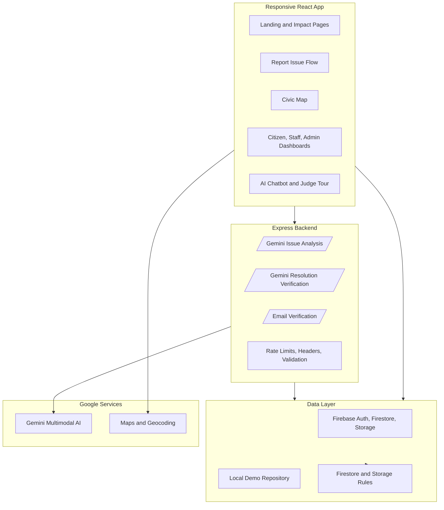
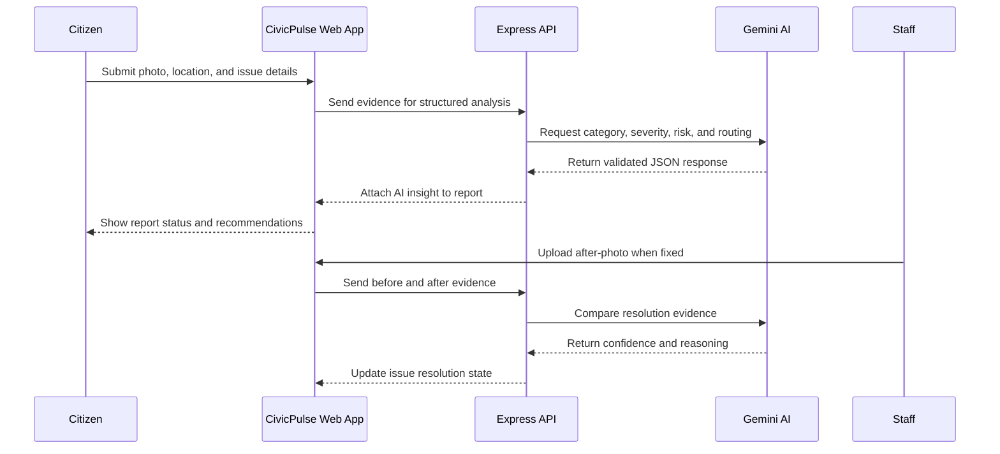
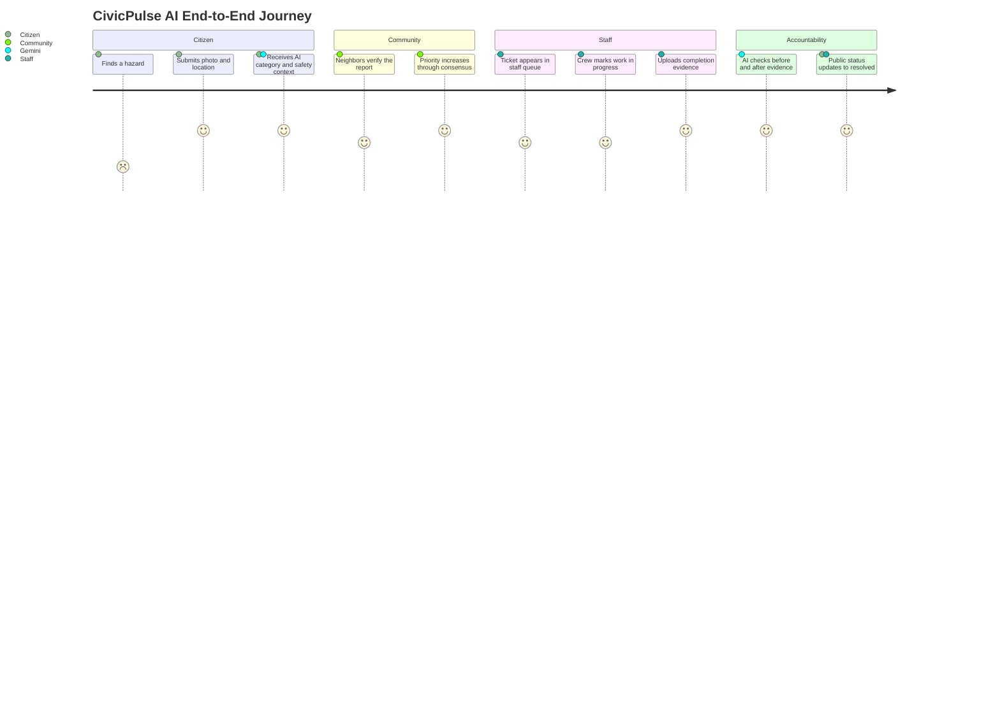

# CivicPulse AI

**AI-powered civic reporting, community verification, and accountable municipal resolution.**

CivicPulse AI is a full-stack civic technology platform built to turn everyday neighborhood problems into visible, verifiable, and trackable action. Citizens can report potholes, broken streetlights, garbage dumping, water leaks, unsafe manholes, and other public hazards with photo evidence. Gemini AI analyzes the issue, the community validates it, staff manage it through a resolution workflow, and the public can see progress from first report to verified fix.

It is designed for hackathons, civic innovation demos, and real-world municipal pilots where the winning idea is not just a beautiful interface, but a complete trust loop: report, classify, verify, prioritize, resolve, and prove the fix.

## Why It Exists

Most civic complaint systems fail at the same points:

- Citizens do not know which department owns an issue.
- Duplicate complaints flood municipal teams.
- High-risk hazards are buried under low-priority tickets.
- Citizens cannot see whether anything is happening.
- Resolution claims are difficult to verify.
- Good civic participation is rarely rewarded.

CivicPulse AI solves this with a transparent, AI-assisted civic operating system. It combines photo-based issue detection, location-aware reporting, community consensus, staff dashboards, before/after verification, analytics, and gamification into one polished web experience.

## What The Website Does

| Area | Capability |
| --- | --- |
| Citizen reporting | Upload or capture issue evidence, describe the problem, set location, and submit a structured civic report. |
| Gemini AI analysis | Categorizes the issue, estimates severity, recommends department routing, identifies public risk, and returns structured JSON. |
| Community verification | Nearby residents can confirm, dispute, or support reports so priority is based on public consensus, not just one complaint. |
| Duplicate prevention | Reports can be compared by category and location to reduce repeated tickets for the same hazard. |
| Public issue tracking | Every issue moves through a visible lifecycle from submitted to verified, assigned, in progress, and resolved. |
| Staff operations | Municipal staff can inspect queues, update status, add notes, assign departments, and upload resolution proof. |
| AI resolution checking | Gemini compares before and after evidence to help verify whether a fix actually happened. |
| Admin control | Admin users can oversee reports, users, announcements, safety workflows, and system-level activity. |
| Civic map | Issues are displayed spatially with filtering, category context, and location-driven discovery. |
| Analytics | Dashboards surface issue volume, categories, resolution patterns, and civic impact metrics. |
| Rewards | Citizens earn points and recognition for useful reports and verification activity. |
| PWA experience | Installable, responsive, mobile-first web app with service worker support and app metadata. |
| Security | Auth, role-based access, input validation, rate limiting, Firestore and Storage rules, and security-focused tests. |

## Product Story

```mermaid
flowchart LR
    A[Citizen sees civic hazard] --> B[Uploads photo and location]
    B --> C[Gemini analyzes category, severity, risk, department]
    C --> D[Report appears on public map]
    D --> E[Neighbors verify or dispute]
    E --> F[Priority score updates]
    F --> G[Staff dashboard receives routed ticket]
    G --> H[Municipal crew resolves issue]
    H --> I[Before and after evidence checked]
    I --> J[Citizen trust, points, and public accountability improve]
```



## System Architecture



## AI Workflow



## Built For Three Audiences

**Citizens**

- Fast issue reporting from mobile or desktop.
- Clear safety guidance and status updates.
- Civic points, leaderboard, and profile progress.
- Transparent map of what is happening nearby.

**Municipal Staff**

- Work queue for reported and verified issues.
- Department routing and status updates.
- Resolution upload flow with evidence trail.
- Reduced noise from duplicates and low-quality reports.

**Administrators and Judges**

- End-to-end demo journey.
- Analytics and audit-style visibility.
- Security posture and validation tests.
- Clear explanation of AI, map, auth, and data flows.

## Tech Stack

| Layer | Technology |
| --- | --- |
| Frontend | React 19, TypeScript, Vite, Tailwind CSS |
| Backend | Node.js, Express, TSX, ESBuild |
| AI | Google Gemini via `@google/genai` |
| Maps | Google Maps Platform and Leaflet-ready mapping support |
| Auth and Data | Firebase Auth, Firestore, Firebase Storage, local demo repository |
| Validation | Zod, structured AI response validation |
| Visualization | Chart.js, react-chartjs-2, Three.js, React Three Fiber |
| UX | Framer Motion, Lucide React, responsive PWA shell |
| Testing | Vitest, Supertest, TypeScript checking |

## Feature Highlights

### 1. AI-Powered Issue Intelligence

Gemini turns unstructured photos into structured civic intelligence. The system can classify hazards, estimate seriousness, route tickets to the right department, and provide safety recommendations. This makes reports more useful before a human staff member even opens the dashboard.

### 2. Community Trust Layer

Reports become stronger when the neighborhood confirms them. CivicPulse AI uses verification activity to raise confidence, reduce fake reports, and build a shared public record. This makes the system more democratic and harder to manipulate.

### 3. Resolution Proof, Not Just Status Text

Staff can upload after-repair evidence. Gemini compares before and after images to help determine whether the issue appears resolved. This closes the accountability gap that many complaint portals leave open.

### 4. Full Demo Experience

The app includes demo data, role flows, a judge-friendly tour companion, analytics, leaderboard, map pages, issue detail pages, staff tools, admin pages, security docs, and tests. It is built to show a complete product vision instead of a single isolated feature.

## Core User Journey



## Project Structure

```text
CivicPlusAI/
|-- assets/                  Demo and presentation assets
|-- data/                    Local demo data and backups
|-- public/                  PWA manifest, service worker, public assets
|-- server/                  Backend service helpers
|-- src/
|   |-- components/          Reusable UI, chatbot, maps, dashboards, 3D scene
|   |-- context/             Authentication context
|   |-- data/                Demo seed data and chatbot knowledge
|   |-- i18n/                Translation resources
|   |-- lib/                 API client and validation logic
|   |-- pages/               Route-level application screens
|   |-- services/            Firebase and local repository implementations
|   |-- test/                Security, validation, repository, chatbot tests
|   |-- App.tsx              Main app routing and shell
|   |-- main.tsx             React entry point
|   `-- types.ts             Shared TypeScript models
|-- server.ts                Express API, Gemini endpoints, security middleware
|-- firestore.rules          Firestore access controls
|-- storage.rules            Firebase Storage access controls
|-- vite.config.ts           Vite and test configuration
`-- package.json             Scripts and dependencies
```

## Getting Started

### Prerequisites

- Node.js 18 or newer
- Gemini API key from Google AI Studio
- Optional Firebase project for production-style auth, database, and storage
- Optional Google Maps API key for full map capabilities

### Installation

```bash
git clone https://github.com/AustinKarasu/CivicPulse.git
cd CivicPulse
npm install
cp .env.example .env
npm run dev
```

The app runs at:

```text
http://localhost:3000
```

### Environment Variables

Use `.env.example` as the source of truth. The most important value for AI features is:

```bash
GEMINI_API_KEY=your_gemini_api_key
```

Firebase and Maps keys can be added when running a connected deployment. The app also includes local demo repository support so the product can be explored without a full production backend.

## Scripts

| Script | Purpose |
| --- | --- |
| `npm run dev` | Start the full-stack development server. |
| `npm run build` | Build the Vite frontend and bundled Node server. |
| `npm start` | Run the production server bundle. |
| `npm run lint` | Run TypeScript checking. |
| `npm run test` | Run Vitest test suites. |
| `npm run clean` | Remove generated build artifacts. |

## Security And Reliability

- Firebase Authentication with role-aware application flows.
- Firestore and Storage security rules.
- Server-side API validation with Zod.
- Structured Gemini responses to reduce brittle parsing.
- Rate limiting and retry behavior around AI endpoints.
- Security headers for production hardening.
- DOMPurify usage for sanitization.
- Tests covering validation, repository behavior, chatbot constraints, and security expectations.

## Why This Can Win

CivicPulse AI is not only a reporting form. It is a civic trust engine.

It shows technical depth through multimodal AI, maps, auth, validation, dashboards, storage rules, testing, and full-stack deployment. It shows product maturity through citizen, staff, and admin workflows. Most importantly, it solves a real public problem with a measurable accountability loop: every report becomes data, every verification improves trust, and every claimed fix can be challenged with evidence.

## License

Apache-2.0
