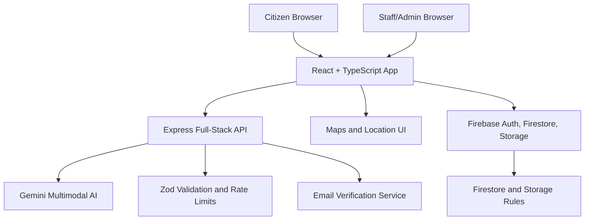
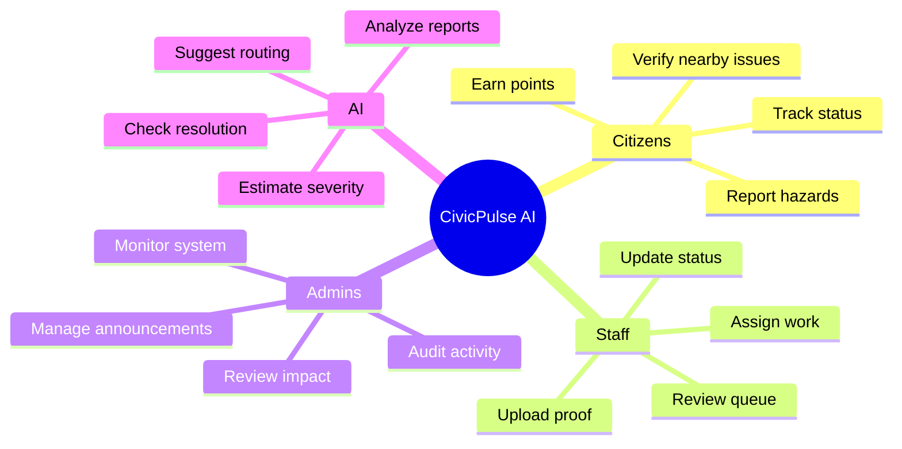

# CivicPulse AI Submission

## Project Name

**CivicPulse AI**  
AI-powered civic reporting, verification, and municipal accountability.

## One-Line Pitch

CivicPulse AI turns neighborhood problems into AI-classified, community-verified, publicly trackable civic action.

## Problem

Cities receive thousands of complaints about potholes, broken lights, garbage dumping, drainage failures, unsafe manholes, and other hazards. The existing complaint process is often slow, fragmented, and difficult to trust.

Key pain points:

- Citizens do not know where to report or who owns the issue.
- Municipal staff receive vague, duplicate, or low-quality complaints.
- Urgent hazards are not always prioritized quickly.
- Communities cannot easily verify whether a fix actually happened.
- Good civic participation is invisible and unrewarded.

## Solution

CivicPulse AI creates a complete civic action loop:


Citizens upload photo evidence and location data. Gemini AI analyzes the image, classifies the issue, estimates severity, suggests the responsible department, and returns structured data. Nearby residents can confirm or dispute the report. Staff can manage the issue through a transparent workflow. When a fix is claimed, before and after photos can be checked to help verify the resolution.

## What Makes It Strong

| Strength | Why It Matters |
| --- | --- |
| Multimodal Gemini AI | Converts raw photos into structured civic intelligence. |
| Community verification | Adds local trust and reduces fake or duplicate reports. |
| Transparent tracking | Citizens can see the lifecycle of each issue. |
| Staff workflow | The product is useful for authorities, not only citizens. |
| Resolution verification | Fixes are supported by evidence, not just status labels. |
| Gamification | Rewards helpful civic participation. |
| Security posture | Auth, validation, rules, rate limits, and tests are included. |
| Demo completeness | Landing pages, map, dashboards, chatbot, tour, analytics, and role flows are built. |

## Google AI Usage

### Gemini Issue Analysis

Endpoint: `/api/gemini/analyze`

Gemini analyzes uploaded civic issue photos and returns structured JSON containing:

- Issue category
- Severity estimate
- Public safety risk
- Department recommendation
- Suggested next actions
- Citizen-facing safety guidance
- Confidence and reasoning

### Gemini Resolution Verification

Endpoint: `/api/gemini/verify-resolution`

Gemini compares original report evidence with after-repair evidence to help determine whether the issue appears fixed. This helps prevent false closure and strengthens public accountability.

### Structured Output

The backend validates AI output with schemas so the product can depend on predictable machine-readable responses instead of fragile text parsing.

## Architecture



## Demo Flow

1. Open the landing page and review the civic impact story.
2. Start a report for a pothole, leak, garbage issue, streetlight problem, or manhole hazard.
3. Upload evidence and location details.
4. Gemini classifies the issue and explains its likely urgency.
5. Submit the report and view it in the issue system.
6. Explore map, dashboards, analytics, leaderboard, and issue detail pages.
7. Use staff/admin flows to update status and add resolution proof.
8. Run before/after verification to demonstrate the accountability loop.

## User Roles



## Technology

- React 19, TypeScript, Vite, Tailwind CSS
- Node.js and Express
- Google Gemini via `@google/genai`
- Firebase Authentication, Firestore, and Storage
- Google Maps and mapping-ready UI
- Chart.js, Three.js, React Three Fiber, Framer Motion
- Zod validation, DOMPurify sanitization, security headers
- Vitest and Supertest coverage

## Impact

CivicPulse AI helps cities move from complaint collection to civic accountability. It can reduce duplicate complaints, improve department routing, surface urgent hazards faster, reward public participation, and make resolution claims easier to verify.

The result is a project with both technical depth and social relevance: a polished product that demonstrates how AI can improve local governance in a way citizens can see and trust.

## How To Run

```bash
npm install
cp .env.example .env
npm run dev
```

Then open:

```text
http://localhost:3000
```

Add `GEMINI_API_KEY` in `.env` to enable AI-powered analysis and verification.
